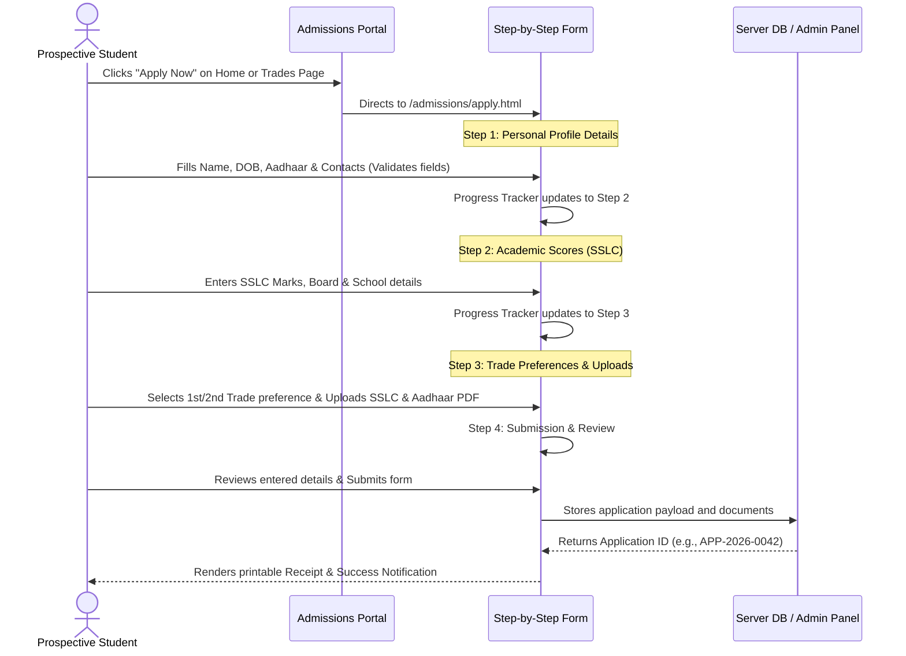

# INFORMATION ARCHITECTURE & SITE MAP BLUEPRINT
## Project: M.E.S. Private ITI Mundur Website Rebuild

---

### DOCUMENT CONTROL
* **Version**: 2.0 (Rebuild Blueprint)
* **Date**: June 9, 2026
* **Target Platforms**: Responsive Web (Desktop, Tablet, Mobile)
* **Status**: Ready for Implementation
* **Objectives**: Modernize user engagement, streamline online admissions, ensure full NCVT/DGT compliance, and integrate visual hierarchies inspired by [MES Kalladi College](https://meskc.ac.in/) and [MES Medical College](https://mesmedicalcollege.edu.in/).

---

## 1. GLOBAL NAVIGATION ARCHITECTURE

The rebuild website utilizes a dual-tier navigation system to segregate compliance and quick actions from primary marketing and educational pages.

| Tier | Component | Target Audience | Primary Function |
| :--- | :--- | :--- | :--- |
| **Tier 1 (Utility Top Bar)** | Statutory Cells, NCVT Disclosures, Quick Links | Audit Inspectors, Parents, Current Students | Regulatory compliance and direct contact |
| **Tier 2 (Sticky Main Navbar)** | Home, About, Trades, Admissions, Blog, Gallery, Contact | Prospective Students, Parents, Recruiters | Direct conversion funnel and educational exploration |

```mermaid
graph TD
    %% Site Architecture
    TopBar[Utility Top Bar] --> Statutory[Statutory Cells Dropdown]
    TopBar --> NCVTMIS[NCVT MIS Portal Link]
    TopBar --> Helpline[Helpline: +91-491 2832248]
    
    Navbar[Sticky Main Navbar] --> Home[Home / Overview]
    Navbar --> About[About & Accreditation]
    Navbar --> Trades[Vocational Trades]
    Navbar --> Admissions[Admissions Portal]
    Navbar --> Blog[Event & Activity Blog]
    Navbar --> Gallery[Media Gallery]
    Navbar --> ContactUs[Contact Us]
    
    %% Dropdowns
    Statutory --> AntiRag[Anti-Ragging Cell]
    Statutory --> Grievance[Grievance Redressal]
    Statutory --> WomenCell[Women Cell & ICC]
    Statutory --> Disclosures[Mandatory Disclosures Document]
    
    About --> Profile[Institutional Profile]
    About --> Trust[Management Board & MES Trust]
    About --> Affli[NCVT Affiliation Status]
    
    Trades --> Elec[Electrician - 2 Yrs]
    Trades --> Draught[Draughtsman Civil - 2 Yrs]
    Trades --> EMech[Electronic Mechanic - 2 Yrs]
    Trades --> Wireman[Wireman - 2 Yrs]
    Trades --> Plumber[Plumber - 1 Yr]
    
    Admissions --> Guidelines[Eligibility & Fees]
    Admissions --> Form[Multi-Step Application Form]
    Admissions --> Status[Enquiry / Application Status]
```

---

## 2. DETAILED PAGE SPECIFICATIONS

### 2.1 Utility Header (Top Bar)
* **URL**: Global (Always rendered at `y = 0`)
* **Core Purpose**: Maintain immediate accessibility for regulatory oversight and support.
* **Component Matrix**:
  * **Statutory Dropdown Menu**:
    * **Anti-Ragging Committee**: Lists committee members, phone numbers, and download links for the UGC/DGT anti-ragging affidavit.
    * **Grievance Redressal Cell**: Interactive online complaint lodging form for student body representation.
    * **Internal Complaints Committee (ICC)**: Policies and contact nodes for women safety.
    * **SC/ST & Minority Support Cell**: Outlines administrative aid, scholarships, and representation cells.
  * **Mandatory Disclosure Link**: Direct hyperlink to download a consolidated PDF of infrastructural, land, and staff lists (NCVT compliant).
  * **NCVT MIS Redirect**: External target `https://www.ncvtmis.gov.in/` opening in a new tab.
  * **Admissions Contact Node**: Clickable link: `tel:+914912832248` (Mundur Office).

---

### 2.2 Primary Header & Main Content Pages

#### A. Home Page (`/index.html`)
* **Goal**: Maximize conversion for trade enquiries and present a premium brand image.
* **Key Content Copy**:
  * *Headline*: "Imparting Technical Excellence Since Inception"
  * *Core Statement*: "Dr. P.K. Abdul Ghafoor Memorial M.E.S. Private Industrial Training Institute is imparting technical training in vocational trades enabling students for appearing for the All India Trade Test (AITT) conducted by the National Council for Vocational Training (NCVT)..."
* **Functional Elements**:
  * **Hero Image Slider**: Full-viewport image carousel featuring high-resolution images of workshops, survey equipment, and the green campus landscape.
  * **Latest Announcements Ticker**: Horizontal marquee fetching real-time announcements (e.g., "Registration open for the 2026 All India Trade Test").
  * **Trade Spotlight Card Deck**: Interactive grid displaying the five core trades. Hovering scales the card and exposes the "Apply Now" secondary CTA.
  * **Placement Counter**: Animated digits showing placement rates (e.g. "94% placed") and sliding logos of top local and national recruiters.
  * **Director/Principal message snippet**: Brief profile card with photo and link to the full text.

#### B. About & Affiliation (`/about/profile.html`)
* **Goal**: Build institutional trust and display national accreditation credentials.
* **Key Content Copy**:
  * *Profile*: "M.E.S. Private ITI is a well-known institute engaged in providing various technical courses. The main reason behind providing these courses is to enhance the skill of the candidate so that they can earn their livelihood independently. Our aim is to polish the skills of individuals and to make them capable enough to grab better job opportunities."
* **Functional Elements**:
  * **NCVT Affiliation Registry**: Structured, searchable HTML table detailing Trade Name, Unit Count, Affiliation Status, and year of NCVT accreditation.
  * **MES Trust Leadership Board**: Grid layout displaying photos, names, and profiles of the governing board members.

#### C. Vocational Trades Pages (`/trades/`)
Each trade has a dedicated details page.

| Page Slug | Trade Name | Duration | Entry Criteria | Career Outcomes |
| :--- | :--- | :--- | :--- | :--- |
| `/trades/electrician.html` | Electrician (NCVT) | 2 Years | Pass in 10th Class (SSLC) | KSEB Lineman, Metro Railways, Maintenance Engineer, Industrial Contractor |
| `/trades/draughtsman-civil.html` | Draughtsman - Civil (NCVT) | 2 Years | Pass in 10th Class (SSLC) | CAD Designer, Civil Site Surveyor, Town Planning Assistant, Estimator |
| `/trades/electronic-mechanic.html` | Electronic Mechanic (NCVT) | 2 Years | Pass in 10th Class (SSLC) | PCB Prototyper, Solar Panel Specialist, Automation Tech, Consumer Electronics Repair |
| `/trades/wireman.html` | Wireman (NCVT) | 2 Years | Pass in 10th Class (SSLC) | Domestic Electrification, Electrical Inspector, Panel Assembly Line |
| `/trades/plumber.html` | Plumber (NCVT) | 1 Year | Pass in 10th Class (SSLC) | Pipe Network Layout Planner, Sanitation Supervisor, Municipal Water works |

* **Trades Page Functional Components**:
  * **Syllabus Download CTA**: Prominent PDF download button for the NCVT curriculum.
  * **Machinery & Tool List**: Toggle-based list showing the main equipment available in the labs (e.g., Oscilloscopes, Survey Theodolites, Motor Testbeds).

#### D. Event & Activity Blog (`/blog/`)
* **Goal**: Boost SEO indexing and highlight campus activities.
* **Functional Elements**:
  * **Blog Feed (`/blog/index.html`)**: Layout using a 3-column card deck with an search box and filter tabs (*All, Technical, Cultural, Notices, Sports*).
  - **Single Post View (`/blog/post-detail.html`)**: Rich typography column, social sharing widget, and lateral sidebars showing "Latest Announcements".

#### E. Admissions Application Portal (`/admissions/`)
* **Goal**: Secure and simplify student registration.
* **Interactive Portal Elements**:
  * **Eligibility Dashboard**: Table showing age limits, selection criteria, reservation quotas, and fee structures.
  * **Online Admission Application Form (`/admissions/apply.html`)**: Detailed in Section 3.

#### F. Media Gallery (`/gallery.html`)
* **Goal**: Provide a visual showcase of the campus life and infrastructure.
* **Functional Elements**:
  * **Masonry Photo Album Grid**: Lazy-loaded image grid with filtering buttons.
  - **Interactive Lightbox Overlay**: Full-viewport image navigation with touch swipe support for mobile.

#### G. Contact Us (`/contact.html`)
* **Goal**: Direct contact and enquiry collection.
* **Functional Elements**:
  * **Responsive Google Maps Embed**: Custom styled map showing driving directions.
  * **Contact Cards**: Clickable phone icons and email targets.
  - **Enquiry Form**: Text inputs for Name, Phone (10-digit validation), Email, Trade Preference, and Message.

---

## 3. INTERACTIVE USER JOURNEYS (ADMISSION APPLICATION FLOW)

To secure enrollments, the user flow for the **Online Admission Application** is mapped below:

---

## 4. NCVT / DGT COMPLIANCE DISCLOSURE CHECKLIST

To satisfy DGT (Directorate General of Training) and NCVT audit regulations, the following items are mapped and must be reachable within 2 clicks from the home page:

* [ ] **NCVT Affiliation Order**: Uploaded scan links to the original sanction letters from the Ministry of Labour, Govt. of India.
* [ ] **Governing Body Registry**: Names, designations, and addresses of members of the MES management trust.
* [ ] **Trade Units List**: Affiliated units list showing seat capacities and active trade allocations.
* [ ] **Staff Profiles**: List of all qualified instructors, their designations, qualifications, and trade allocations.
* [ ] **Workshop Floor Space**: Detailed statement showing area (in square meters) of all practical workshops.
* [ ] **Equipment / Machinery Index**: Auditable listing of technical apparatus available for trade practical tests.
* [ ] **Grievance & Anti-Ragging Committees**: Public display of committee members, helpline emails, and active phone numbers.
* [ ] **Admissions Criteria**: Public notification of the transparent, merit-based selection process and fee schedules.
